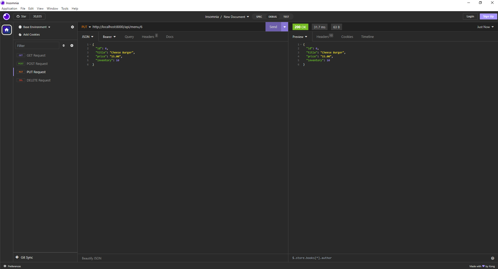

	

 

Welcome to the **Little Lemon Django Project**, a comprehensive restaurant management system built using the Django web framework. This project aims to streamline the operations of a restaurant, making it easier for restaurant owners and staff to manage menus, bookings, and customer information efficiently.

 

## Project Overview

Running a restaurant involves various complex tasks, from managing the menu and inventory to handling customer reservations and orders. The **Little Lemon Django Project** offers a solution that simplifies these processes by providing a user-friendly web interface and a set of RESTful APIs.

 

## Key Features

### Menu Management

Effortlessly create, update, and delete menu items. Keep track of prices, availability, and other relevant details. Ensure that your menu is always up-to-date and accurate.

### Booking System

Manage customer reservations with ease. Schedule bookings, assign tables, and record important information such as the number of guests and contact details.

### User Authentication

Secure access to your restaurant management system with user authentication. Grant different levels of access to staff members, allowing them to perform specific tasks while maintaining data privacy.

### RESTful APIs

Interact with the system programmatically through RESTful APIs. Integrate the system with other tools and platforms to enhance functionality and automation.

 

### Set Up MySQL Database

#### Access MySQL (replace password with your MySQL password)
	
	mysql -u root -P 3307 -p

or

    mysql -u root -p

#### Create the database if it doesn't exist

	CREATE DATABASE IF NOT EXISTS littlelemon;

#### Show existing databases

	SHOW DATABASES;

#### Use the "littlelemon" database

	USE littlelemon;

#### Drop the 'admin' user if it exists (optional)

	DROP USER IF EXISTS 'admin'@'127.0.0.1';

#### Flush privileges (optional)

	FLUSH PRIVILEGES;

#### Create a new 'admin' user with a password

	CREATE USER 'admin'@'127.0.0.1' IDENTIFIED BY 'password';

#### Grant all privileges to the 'admin' user on the 'littlelemon' database

	GRANT ALL PRIVILEGES ON littlelemon.* TO 'admin'@'127.0.0.1';

#### Exit MySQL

	exit 

 

## Installation

1. Clone the repository to your local machine.
2. Create a virtual environment and activate it:

	   pipenv shell

3.  Install the project dependencies:
      
		pipenv install django
		pipenv install mysqlclient
		pip install djangorestframework
		pip install djangorestframework-xml
		pip install djoser 
    
4.  Configure the MySQL database by creating a database named `littlelemon` and a user named `admin` with the password `password`. Update the database settings in `littlelemon/settings.py` if needed.
    
5.  Apply database migrations:
      
		python manage.py makemigrations
		python manage.py migrate 
    
6.  Create a superuser to access the Django admin panel:
       
		python manage.py createsuperuser
    
7.  Start the development server:
    
	    python manage.py runserver 
    
 

## Usage

-   Access the admin panel at `http://localhost:8000/admin/` and log in with your superuser credentials.
-   Explore the RESTful APIs at `http://localhost:8000/api/` to manage menu items and bookings.
-   Use tools like Insomnia or Postman to interact with the APIs.

 

## Testing URLs

MySQL Databases

	

	

    http://127.0.0.1:8000/auth/users/

	

	

        
    http://127.0.0.1:8000/auth/token/login/

	

	

    
    
    http://127.0.0.1:8000/api/menu/

	

 
    
    http://127.0.0.1:8000/api/menu/1

	

 
    
    http://127.0.0.1:8000/api/booking/tables/

	

 
    
    http://127.0.0.1:8000/api/booking/tables/6

	

 

PUT Request

	

 

POST Request

	

 

DELETE Request

	

 

 

 

## Contributing

Feel free to contribute to this project by submitting issues or pull requests.

 

## Contact Me

If you have any questions, feedback, or suggestions, please feel free to reach out:

- Twitter: [@Doguilmak](https://twitter.com/Doguilmak)
- Email: doguilmak@gmail.com
